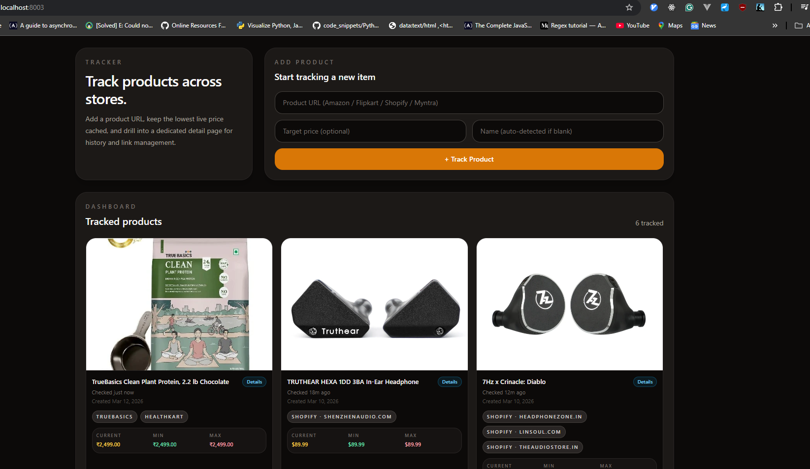
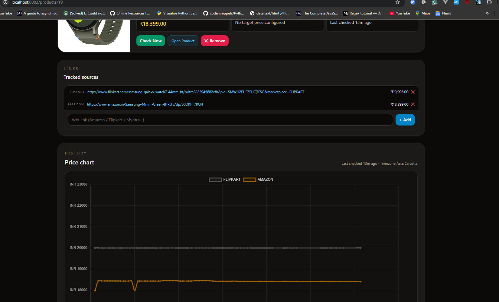

# Product Price Tracker

Track product prices across multiple online stores from a single dashboard. Add a product URL, and the app will periodically scrape the latest price, maintain a history, and alert you when prices drop below your target.





## Features

- **Multi-store support** — Amazon, Flipkart, Shopify, Myntra, Healthkart
- **Automatic price checks** — Celery Beat runs on a configurable schedule
- **Price history charts** — visual price trends per product and source
- **Multiple links per product** — compare the same item across stores
- **Alerts** — Gmail and Telegram notifications when the price drops below a target, plus Telegram alerts whenever a checked price changes from its last recorded value
- **REST API** — full CRUD under `/api` with Swagger at `/docs`

## Tech Stack

| Layer            | Technology                         |
| ---------------- | ---------------------------------- |
| Web framework    | FastAPI                            |
| Task queue       | Celery + Redis                     |
| Database         | PostgreSQL                         |
| Browser scraping | Playwright (Chromium)              |
| Frontend         | Jinja2 templates served by FastAPI |
| Containerisation | Docker + Docker Compose            |

## Prerequisites

- [Docker](https://docs.docker.com/get-docker/) and [Docker Compose](https://docs.docker.com/compose/install/) (v2+)

## Getting Started

### 1. Clone the repo

```bash
git clone https://github.com/sreevardhanreddi/product-tracker.git
cd product-tracker
```

### 2. Create your `.env` file

```bash
cp .env.example .env
```

Edit `.env` to set any secrets (database credentials, Gmail app password, Telegram bot token, etc.). The defaults work out of the box for local development.

### 3. Run with Docker Compose

**Development** (with live reload and source-mounted volumes):

```bash
docker compose -f docker-compose.dev.yml up --build
```

The app will be available at **http://localhost:8003**.

**Production**:

```bash
docker compose -f docker-compose.prod.yml up --build -d
```

The app will be available at **http://localhost:8000**.

### 4. Stop the services

```bash
# Development
docker compose -f docker-compose.dev.yml down

# Production
docker compose -f docker-compose.prod.yml down
```

To also remove persisted data volumes:

```bash
docker compose -f docker-compose.dev.yml down -v
```

## Services Overview

Both Compose files spin up the same set of services:

| Service           | Purpose                            |
| ----------------- | ---------------------------------- |
| **postgres**      | PostgreSQL 16 database             |
| **redis**         | Redis 7 broker for Celery          |
| **adminer**       | Browser-based PostgreSQL explorer  |
| **migrate**       | Runs Alembic migrations then exits |
| **app**           | FastAPI web server                 |
| **celery_worker** | Processes price-check tasks        |
| **celery_beat**   | Schedules periodic price checks    |

In development, Adminer is available at `http://localhost:8080` for inspecting the Postgres database. The server defaults to `postgres`. Use:

- System: `PostgreSQL`
- Server: `postgres`
- Username: value of `POSTGRES_USER` from `.env`
- Password: value of `POSTGRES_PASSWORD` from `.env`
- Database: value of `POSTGRES_DB` from `.env`

## Configuration

All configuration is done through environment variables in `.env`. See `.env.example` for the full list. Key variables:

| Variable                                  | Description                                              |
| ----------------------------------------- | -------------------------------------------------------- |
| `DATABASE_URL`                            | PostgreSQL connection string                             |
| `REDIS_URL`                               | Redis connection string                                  |
| `PRICE_CHECK_INTERVAL_MINUTES`            | How often to re-check prices (default `60`)              |
| `PRICE_CHANGE_NOTIFY_MIN_PERCENT`         | Minimum percentage change required before sending a price-change alert (default `1.0`) |
| `GMAIL_USER` / `GMAIL_PASSWORD`           | Gmail credentials for email alerts                       |
| `TELEGRAM_BOT_TOKEN` / `TELEGRAM_CHAT_ID` | Telegram bot for push alerts                             |
| `PLAYWRIGHT_HEADLESS`                     | `true` for headless scraping, `false` to see the browser |

## API Docs

Once the app is running, interactive API documentation is available at:

- Swagger UI — `http://localhost:<port>/docs`
- ReDoc — `http://localhost:<port>/redoc`
